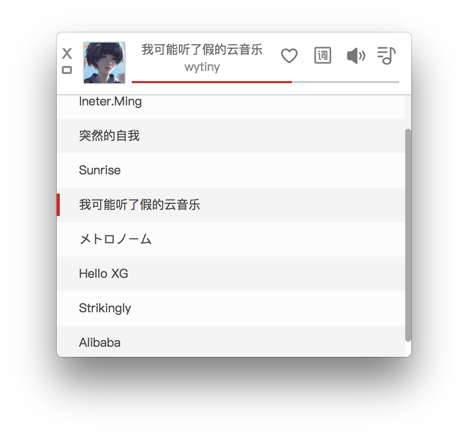

## electronic-netease-music

NetEase Music Electron Application (`_(:з」∠)_`)...基于Electron的山寨Mac版网易云音乐


<a href="#music-box" id="music-box"></a>

> Using external image links in markdown tends to fail the image loading, so I included image files in this repo.

## Usage

#### Development

```shell
git clone https://github.com/Tinysymphony/electronic-netease-music
cd electronic-netease-music
npm install
npm start
```

#### Build App

```shell
npm run build:osx
```

LICENSE MIT
